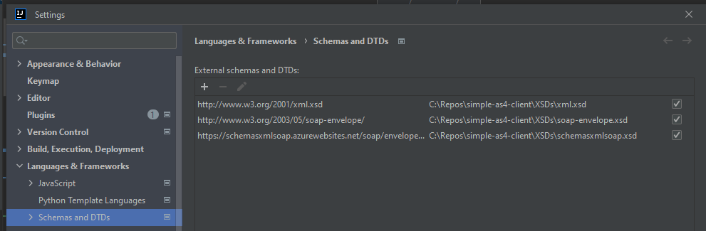

# simple-as4-client
This repository contains the simple-as4 Client, made for the DMS project to help economical operators communicate with the AS4 gateway.

The public DMS project repository can be found here: <br/>
[Public DMS Github Repository](https://github.com/skat/dms-public) <br/><br/>

## Quick start guide
* Add the simple-as4-client dependency to your project.
* Configure a Client using the ClientBuilder (builder pattern)
* Use the Client to send data with the method ExecutePush.

For an example on how to setup a simple client and a more advanced client, meant to simulate being behind a proxy, please refer to the [example project](https://github.com/skat/simple-as4-client/tree/main/example) attached to this repository.

## Requirements
In order to run this project you will need to be onboarded with the DMS project and have followed the documentation [available on skats Github](https://github.com/skat/dms-public) specifically the [Connectivity Guide](https://github.com/skat/dms-public/blob/master/dokumenter/ConnectivityGuide.docx), and have the following artifacts available:
* A Voces certificate with correct credentials
* A trust store certificate 
* A properties file which contains the information about these two certificates.

Typically these three files will be placed together in the resources/security folder.
The properties file will look something like this:

```properties
# Company Keystore
org.apache.wss4j.crypto.merlin.keystore.file=/security/companyname-keystore.jks
org.apache.wss4j.crypto.merlin.keystore.password=yourpassword
org.apache.wss4j.crypto.merlin.keystore.type=jks
org.apache.wss4j.crypto.merlin.keystore.alias=youralias
org.apache.wss4j.crypto.merlin.keystore.private.password=yourprivatepassword

# Truststore
org.apache.wss4j.crypto.merlin.truststore.file=/security/as4-holodeck-trust.jks
org.apache.wss4j.crypto.merlin.truststore.password=password
org.apache.wss4j.crypto.merlin.truststore.alias=alias
org.apache.wss4j.crypto.merlin.truststore.type=jks
```

##How to add simple-as4-client to your Java project
Maven dependency:
```xml
<dependency>
    <groupId>io.github.skat</groupId>
    <artifactId>as4-client</artifactId>
    <version>1.1.0</version>
</dependency>
```

Gradle dependency:
```json
implementation 'io.github.skat:as4-client:1.1.0'
```

### Setting up Schemas and DTDs to run XJC
Due to the instability of the XJC package (and potential need to run the project from behind firewalls etc) we have added the required XSDs to the XSDs folder in this project.
In order to setup your local IntelliJ IDEA do the following
Hit Ctrl+Alt+S, go to settings Languages and Frameworks, then under Schemas and DTDs add:

http://www.w3.org/2001/xml.xsd - %LocalPathToRepository%/simple-as4-client/XSDs/xml.xsd

http://www.w3.org/2003/05/soap-envelope/ - %LocalPathToRepository%/simple-as4-client/XSDs/soap-envelope.xsd

https://schemasxmlsoap.azurewebsites.net/soap/envelope/?WSDL - %LocalPathToRepository%/simple-as4-client/XSDs/schemasxmlsoap.xsd - 

After completing the setup, the Schemas and DTD's should look like this:

